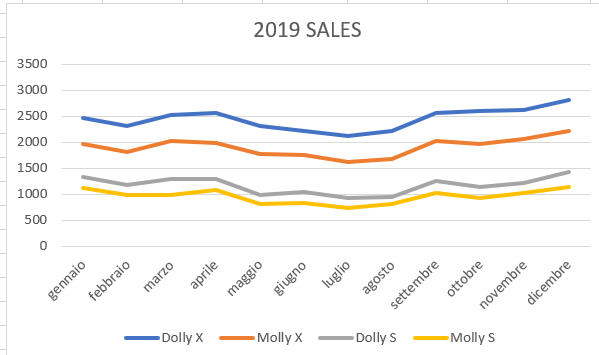
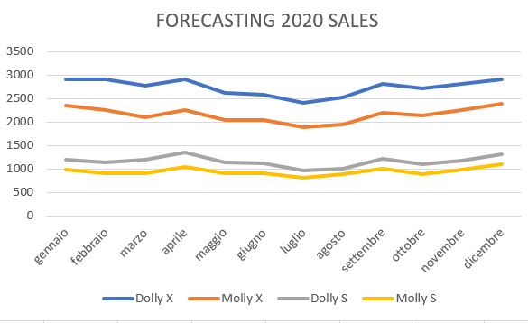

# IR2 - Marketing Plan

### MARKETING DIRECTOR: Matilde Mazzini

## Table of contents:
1) [Introduction](#1-introduction)
2) [Market Analysis](#2-market-analysis)     (Demographic data, Food Consumption)
3) [Competitive Analisys](#3-competitive-analisys)
4) [Segmentation](#4-segmentation)
5) [Distribution channels](#5-distribution-channels)
6) [Product policy](#6-product-policy)
7) [Pricing](#7-pricing)                     
8) [Communication](#8-commuication)          
9) [Monthly order forecast](#9-monthly-order-forecast)
10) [Input to the RFP and RFQ](#10-input-to-the-rfp-and-rfq)

 # 1. Introduction

 This Marketing Plan was drawn up on behalf of the IR2 company.
 It has the purpose to analyze the company and its competitors in order to get closer to the needs of costumers and increase sales accordingly.
 IR2 goal is to increase the penetration in the market share and also to maintain the quality and relayability reputation of the brand.
 IR2 is growing the sales thaks to the recent launhc on the market on the ultimate Xserie line of vacuum cleaner and mop. To develop this product the firms focused on a strong differentiation campaign against the competitors choosin to offer an innovative and smart product following the philosofy of the company: follow and collect customer feedbacks to create a robot product at human measure.

The company’s product portfolio consists of home-cleaning robots. The company mainly invests in R&D to develop new technologies for its home robots, which have resulted in increased sales and revenue growth. Also, it aims to continue focusing on brand awareness and customer conversion. The company updates and launches new products in line with the ongoing technological advancements in the IoT and smart homes space to expand its customer base. iRobot has witnessed sales growth in Italy because of the strong demand for multiple product ranges. In line with this, the company intends to continue to focus on Italy to cater to the needs of its customers. IR2 plans to not only increase penetration of its products in the existing markets but also promote its existing products in new markets. The company also aims to develop and launch new products in current and adjacent markets. Its prime strategy is to maintain a leadership position by delivering robotic technology-based remote presence and automated home maintenance solutions, while extending technical leadership in the areas of autonomous navigation, manipulation, and cloud connectivity and services.  

 # 2. Market Analysis

The robot vacuum cleaner segment in 2018 was the 25% of total vacuums cleaners segment(>200), a percentage that is expected to significantly grow during the next years.

In 2018, the global RVC was valued at 6.5 billion U.S. dollars; the market value is forecast to reach 39.1 billion U.S. dollars by 2026.
The 46% of the next market growth will come from EMEA region, europe included. 

One of the key drivers for this market will be the growing traction for smart cities.

The European key companies are:
IR2
Dyson Ltd.
iRobot Corp.
Samsung Electronics Co. Ltd.
Neato Robotics

IR2 headquarter is lcoated in Italy, the firm focuses its sells in Italy and it is slowly penetrating the European market share.

# 3. Competitive Analisys
# 3.7 Perceptual Mapping
high quality e high price respect to the competitors
high innovation 

copia schema

# 3.5 Strategic Group Analisys
The most direct competitors of IR2 are Irobot and dyson.
The common strategy adopted by this group is to develop an high price product that ensures quality and innovation
dyson focuses on engime quality and power of suction.
irobot focuses on innovation intended as always more smart devices, iot features and multiple automatic features.

IR2 differs from the competitors because focuses in innovation focusing in optimization of mapping algoritm, enivromental issues feaced by the robot and design of the product.

# 3.7 Growth Share Matrix

IR2 is positioned in the star, is well positioned in Italian Market and there are confident possibilities to grow thks to the overall market growth.
is time to start investing in the firm organization and management to better meet the customer needs in onrder to increase the sells.

## 3.1 PESTE

### Political

### Economic

Customers are willing to pay a proper price in order to affirm their social status, and to swap to an effortlessy way of cleaning.
By the market analisys is seen that the 46% of the next market growth will come also from Europe. 

### Social

### Technological

### Enviromental

## 3.1 SWOT Analysis

## Strengths:
- Brand reputation
- High quality
- Top design, it is not a product to hide, is something to show to define your status
- Top sensors, software
- Constant commitment to innovation
- Relationships with leading global robotic institutes

## Weakness:
- High price
- Only italian national store
- Final price depends also on meccanical parts suppliers costs
- No own production
- Low variety of product choices
- Cost involved in developing the cleaning robots is high
CRESCITA BASSA

## Opportunities:
- Collaboration with more institutes
- Global market growth
- With the new feeedbakc aggregator-> more agile aprocach, more feedback from customersz
- Start own supplier products production 
- Growing awareness about the health and benefits of vacuum cleaners
- Introduction of new robot vacuum concepts

## Threats:
- huge amount of competitors
- imitators of the products
- customers mental barriers againsts robot

# 3.2 Porter's Five Forces Model

## Barriers to entry

- Absolute cost advantages
- Capital requirements.
- Brand identity/loyalty

The robot industry is unattractive to newcomers because of the cost advantage large-scale incumbents possess, the significant amount of capital a new firm would need, and the major established brands already in the industry.  

## Rivalry among competitors

There is a strong rivalry since firms try to differentiate focusing on new features and finding new optimized mapping algorithms and more automatized products.
The competition forces each firm to invest in R&D to find the newest and best technology in order to maintain the visibility among different firms. 

## Substitute products 

There is not much of a threat from substitutes because in a digital age, customers are more and more relying on technology to run their lives. A substitute would be a classical vacuum cleaner that can cost less but the time and physical advantages of a robot are paramount.

## Bargaining power of buyers

- High number of customers
- low size of each order, one product last years.

Due to high number of competitors, customers have high bargaining power, but the quality and the reputation of the brand help the company to keep customers recognize our product as their first choice.

## Bargaining power of suppliers

The IR2 suppliers are divided in two groups:
the critical products suppliers and the leverage products suppliers.

The critical products suppliers have high power because the firm buys the sensors and customized part of the robots from those trusted suppliers.
IR2 is very important those suppliers because its their primary customer. 
The relationships between the firm and the supplier is well established, both IR2 and the suppliers would most likely not want to end their relationships, also because during the years, they established a partnership.

Other accessory and mechanical standard products will be supplied by other multiple suppliers. This leave a little power to this kind of suppliers, having IR2 the possibility to swap to a different competitor.

# 4. Market Segmentation
FORSE VA NELLA MARKET ANALISYS

The cleaning robot market can be segmented on the basis of product, end-use application and geography. 

On the basis of product type, the cleaning robot market can be categorized into:
- pool robot
- window robot
- floor robot
- lawn robot. 

Based on the end-use verticals, the cleaning robot market can be segmented into:
- residential
- commercial
- industrial
- and healthcare applications. 

Furthermore, on the basis of geography, the cleaning robot market is classified into five major regions:
- North America
- Asia Pacific
- Europe
- Middle East
- Africa
- Latin America. 

North America is the most dominant market for cleaning robots owing to the presence of well-established cleaning robot manufacturers and high labor cost.

## Targeting

IR2 focus the strenght in floor robot, for residential use in the Europe region.

## Customer Segmentation

demographics:
- age: young adult, adult
- income: medium-high
- family: families and single workers
- occupation: workers 

psychographics:
- lifestyle: dinamic people, single workers, worker parents with children, families with pets
- personality: innovators, early adopters, dynamic, fashionable

behavioural:
- benefits: look for a reliable product that avoid to take from them precious time to spend with the family or their hobbby and career.
- usage: frequency that they seek from our product. daily.

DESCRIZIONE ACCURATA DEL NOSTRO CUSTOMER.
One of our product strenghts is the design, is an object that anybody interested in beauty and appearance want to show, is not like a classical vacuum cleaner to hide. Our customer is an innovative person, well being, interested in the beauty of the things and in the continuos research of innovation and modernity, looking at the future, never stopping, always on movement, dinamic, focused in his goals.  

# 5. Distribution channels

IR2 adopts two main distribution channels: online and large retail store.
The direct online retail is achieved trough the corporate site of the company: www.IR2.com 
Customers are also reached trough one of the largest national retail chain: Mediaworld. 
The price on both the channels is the same.
The choice of choosing only two distribution channels with the same price help the firm to avoid devaluation perception of the product and limit the perceived dispersion that a client can feel on different online and offline channels, with this strategy the firm can gain in fidelization over time trying to create an increasingly strong brand identity.
the most adopted channel is the retail store due to the necessity of the customers to see the object for real in action and to speak with someone that can help them in the decision before making a significant purchase.

# 6. Product Policy

The products are subdivided into two different product lines: Dolly and Molly. 
The first one is a robot vacuum-cleaner and the second one is a robot mop.
Both the lines offer different versions of each product: the X one and the S one.

The X line is the last release of the products, launched on the market at the end of 2018 , is characterized by more features and competitive software integrations. 
The S line is the previuos release of the product, has a lower price of the X line, is well consolidated on the market starting to leave the maturity phase.

IR2 products are characterized by a minimal and modern design, they can blend armoniously with both modern and more classical forniture environment. The customer is encouraged to show it.

The quality of materials is visible and conquers the customers that always seek something more from the products they buy.

A unique system of latest generation sensors combined with a specific AI make the IR2 robots the best in terms of orientation and interaction with the surrounding environment, able to generate intelligent and optimized cleaning paths in order to save battery and time. 

Panik situation recognition:  the robot can detect the situation in which things are getting bad avoiding to make it worse trying to escape from it and limiting battery waste. Twisted wires in brushes, thin carpets, with fringes or raised corners, insurmountable objects on which competitors' products often jam with no way out.

The height of the robot makes it capable of cleaning under the thinner furniture.

Silent and not annoying sound.

App functions: virtual walls, interaction vacuum-mop, remote controll, robot feedback and alert message on the status of the robot, users feedback collection.

# 7. Pricing

## 7.1 Benchmark with competitors
Our biggest competitors in the high quality and high price range cleaning robot market are Dyson and IRobot.
Below are reported the prices of the competitors TOP products that offer similar values of features of the IR2 X serie products.

Type| Competitor | Product name | Price
|---|---|---|---
Vacuum Cleaner | Dyson Ltd. | Dyson 360 Eye™ | 999.00 EUR 
Vacuum Cleaner |iRobot Corporation | iRobot Roomba s9+ | 1499.00 EUR 
Vacuum Cleaner |iRobot Corporation | iRobot Roomba i7+ | 999.00 EUR
Vacuum Cleaner |Neato Robotics Inc.| Neato d7 | 899.00 EUR
Mop |IRobot Corporation  | IRobot Braava jet M6 | 699.00 EUR
Mop |IRobot Corporation  | IRobot Braava 380T | 399.00 EUR

## 7.2 Markup policy

IR2 applyes a markup of 50% on the final price of the product.

Line | Type | Name | Final Cost | Selling Price | 
-|-|-|-|-|
Line X | Vacuum Cleaner  | Dolly X |     EUR |1099 EUR|  
Line X | Mop             | Molly X |     EUR |899 EUR |
Line S | Vacuum Cleaner  | Dolly S |     EUR |799 EUR |
Line S | Mop             | Molly S |     EUR |699 EUR |

# 8. Communication

The budget for advertisin and promotion in 2020 is of 180000 EUR. 

## Social media promotion
Active accounts on Facebook and Instagram and Youtube periodically publishing posts.

Around 1000 EUR per month in social ads.

## Instagram influencers ads: 
One of our product strenghts is the design, is an object that anybody interested in beauty and appearance want to show, is not to hide. We focus our promoting strategy also thinking about the idea of the person you want to be having this kind of product: an innovative person, well being, interested in the beauty of the things and in the continuos research of innovation and modernity, looking at the future, never stopping, always on movement, dinamic, focused in his goals.  

Because of that tree years ago IR2 started collaborating with some of the most influent people of the web, both in the fashion field, both in the technological and life style field.   

Around 6000 EUR per month in gift and influencer promotion.

## Online ads
Partnership with Google to sponsor IR2 website trhought Google search engine.

Around 8000 EUR per month in google ads.

## Tv ads
In the past TV was one of our main promotion channel spending in specific ads channel. Nowadays we are more and more focusing in the online promotion, putting very modest effort on this channel.

## Promotion on the retail stores
Retail stores have the possibility to lower the price in sales period, and promote the product trought their channels.

## Articles in technology magazines 
Our collaboration with robotic institutes give us the opportunity to release some articles about our software and sensors newest technologies in specialized magazines.

## Innovation fairs and release events
We always attend innovation and tehcnology fairs held in Berlin, Barcellona, Milan, Tokio to expand our business and partnerships opportunities.

# 9. Monthly order forecast

In the next years the IR2 activity will improve due to the increasing penetration of automation in household appliances and busy lifestyle and rising spending capacity of the population on advanced household equipment’s. 

The overall sales in 2020 will increase due the growing popularity of the new X product line and thanks to the increasing visibility of the brand in the international market, at the same time Sales of the S serie products will slightly decrease.

### 2019

|           | Dolly X | Molly X | Dolly S | Molly S | tot
| --------- | ------- | ------- | ------- | ------- | ------|
| **gennaio**   | 2469    | 1960    | 1340    | 1112    |
| **febbraio**  | 2318    | 1819    | 1180    | 993     |
| **marzo**     | 2519    | 2019    | 1290    | 982     |
| **aprile**    | 2568    | 1980    | 1290    | 1082    |
| **maggio**    | 2318    | 1769    | 978     | 822     |
| **giugno**    | 2212    | 1760    | 1040    | 831     |
| **luglio**    | 2118    | 1619    | 934     | 742     |
| **agosto**    | 2218    | 1669    | 940     | 814     |
| **settembre** | 2563    | 2017    | 1260    | 1032    |
| **ottobre**   | 2610    | 1969    | 1140    | 922     |
| **novembre**  | 2618    | 2069    | 1222    | 1027    |
| **dicembre**  | 2821    | 2215    | 1420    | 1138    |
| **tot**       | 29352   | 22865   | 14034   | 11497   | **77748** |

### 2020

|           | Dolly X | Molly X | Dolly S | Molly S | tot   |
| --------- | ------- | ------- | ------- | ------- | ----- |
| **gennaio**   | 2918    | 2349    | 1200    | 982     |       |
| **febbraio**  | 2918    | 2249    | 1140    | 912     |       |
| **marzo**     | 2768    | 2099    | 1200    | 912     |       |
| **aprile**    | 2918    | 2249    | 1350    | 1052    |       |
| **maggio**    | 2618    | 2049    | 1140    | 902     |       |
| **giugno**    | 2578    | 2049    | 1124    | 902     |       |
| **luglio**    | 2418    | 1899    | 961     | 812     |       |
| **agosto**    | 2518    | 1949    | 1010    | 885     |       |
| **settembre** | 2818    | 2199    | 1220    | 1002    |       |
| **ottobre**   | 2718    | 2149    | 1100    | 892     |       |
| **novembre**  | 2818    | 2249    | 1180    | 992     |       |
| **dicembre**  | 2918    | 2399    | 1307    | 1102    |       |
| **tot**       | 33026   | 25988   | 13932   | 11347   | **84093** |

### Annual percentage growth

|               | 2017  | 2018   | 2019   | 2020   |
| ------------- | ----- | ------ | ------ | ------ |
|               | 69913 | 72459  | 77748  | 84093  |
| **% Growth** |       | 3,642% | 6,803% | 7,545% |

