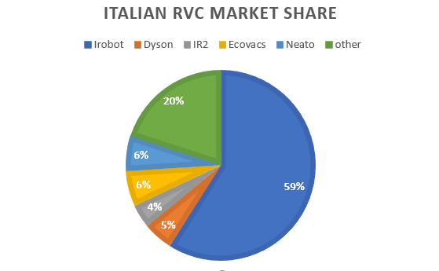
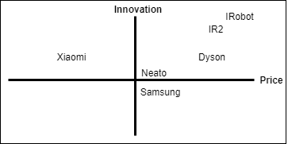
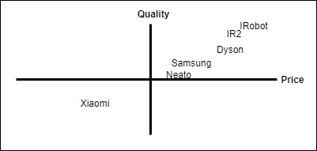

# IR2 - Marketing Plan

### MARKETING DIRECTOR: Matilde Mazzini

## Table of contents:
1) [Introduction](#1-introduction)
2) [Market Analysis](#2-market-analysis)     
3) [Competitive Analysis](#3-competitive-analysis)
4) [Segmentation](#4-segmentation)
5) [Distribution channels](#5-distribution-channels)
6) [Product policy](#6-product-policy)
7) [Pricing](#7-pricing)                     
8) [Communication](#8-commuication)          
9) [Monthly order forecast](#9-monthly-order-forecast)

## 1. Introduction

This Marketing Plan was drawn up on behalf of the IR2 company.
It has the purpose to show a picture of the company and its competitors in order to get closer to the needs of costumers and increase sales accordingly.
IR2 headquarter is located in Italy, the firm focuses its sells in Italy and it is penetrating the European market share.
The company’s product portfolio consists of home-cleaning robots. 
IR2 mainly invests in R&D to develop new technologies for its home robots, which have resulted in increased sales and revenue growth.
IR2 plans to not only increase penetration of its products in Italy but also promote its existing products in Europe, maintaining the quality and relayability reputation of the brand.
IR2 is increasing sales thanks to the recent launch on the market on the last X serie line of vacuum cleaner and mop.

## 2. Market Analysis

The robot vacuum cleaner segment in the market in 2018 was the 25% of total vacuums cleaners segment, a percentage that is expected to significantly grow during the next years.

In 2018, the global RVC market was valued at 6.5 billion U.S. dollars.

The market value is forecast to reach 39.1 billion U.S. dollars by 2026.

The 46% of the next market growth will come from EMEA region, Europe included. 

The reasons for market growth mainly are:
- Decreased time for household activities, robots help humans to perform mundane tasks.
- Improved efficiency and accuracy of robots thanks to the development and evolution of sensors and visualization technologies.
- The technological advancements in the IoT , smart homes and wireless technologies.

The global market key companies are:
- Dyson Ltd.
- iRobot Corp.
- Samsung Electronics Co. Ltd.
- Neato Robotics
- Ecovacs Robotics

IR2 is one of the the largest company in the italian robot cleaning industry, accounting for around 7 percent of the italian market share in 2018.

 

### 2.1 Market Segmentation

The cleaning robot market can be segmented on the basis of product, end-use application and geography. 

On the basis of product type, the cleaning robot market can be categorized into:
- Pool robot
- Window robot
- Floor robot
- Lawn robot. 

Based on the end-use verticals, the cleaning robot market can be segmented into:
- Residential
- Commercial
- Industrial
- Healthcare 

Furthermore, on the basis of geography, the cleaning robot market is classified into five major regions:
- North America
- Asia Pacific
- Europe
- Middle East
- Africa
- Latin America

North America is the most dominant market for cleaning robots owing to the presence of well-established cleaning robot manufacturers and high labor cost.

IR2 focus the strenght in floor robot, for residential use in the Europe region, specifically in Italy.

### 2.2 PEST Analysis

**Political:**

IR2 is plannig to expand its business in the Europe Union because of its safe and predictable econonomic circumstances.
In this way it will be helpful for the company to predict its market growth because Europe is politically stable.

**Economic:**

The Robot vacuum cleaner market is espected to grow in Europe, the willing to pay of the people for robotic home assistance products will be consistent.

**Social:**

In theese time people lifestyles are completely revolutioned by technology that cohexist and cooperate with humans. People that appreciate the help a product like this can give will never go back to the waste of time and physical effort, can focus on their hobbies and careers.

**Technological:**

The whole world of technology is moving towards Iot and AI, this cannot help but make a positive contribution to the robot industry.

## 3. Competitive Analisys

### 3.1 Growth Share Matrix
Star:
IR2 is positioned in the Star, is well positioned in Italian Market and there are confident possibilities to grow thanks to the overall market growth.
Keep investing in R&D in order to maintaid quality and cutting edge technology.

### 3.2 Strategic Group
The most direct competitors of IR2 are IRobot and Dyson.
The common strategy adopted by this group is to develop an high price product that ensures quality and innovation.

Dyson is focused on engine quality and power of suction.

IRobot focuses on the innovation of increasingly intelligent devices, multiple automatic and IoT functions.

IR2 differs from the competitors focusing in optimized mapping algoritm, solving enivromental issues feaced by the robot and the design of the products.

### 3.3 Perceptual Maps

### 3.4 SWOT Analysis

**Strengths**:
- Brand reputation
- High quality
- Top design, it is not a product to hide, is something to show to define your status
- Top sensors and software
- Constant commitment to innovation
- Relationships with leading global robotic institutes

**Weakness**:
- High price
- Only italian national store
- Final price depends also on suppliers costs
- Low variety of product choices
- Cost involved in developing the cleaning robots is high

**Opportunities**:
- Collaboration with European institutes
- Extra European market growth
- Start own supplier products production 
- Growing awareness about the health and benefits of vacuum cleaners
- Introduction of new robot vacuum concepts

**Threats**:
- Huge amount of well positioned competitors
- Imitators of the products
- Customers mental barriers againsts robots

### 3.5 Porter's Five Forces Model

**Barriers to entry**

- Absolute cost advantages
- Capital requirements.
- Brand identity/loyalty

The robot industry is unattractive to newcomers because of the cost advantage large-scale incumbents possess, the significant amount of capital a new firm would need, and the major established brands already in the industry.  

**Rivalry among competitors**

There is a strong rivalry since firms try to differentiate focusing on new features and finding new optimized mapping algorithms and more automatized products.

The competition forces each firm to invest in R&D to find the newest and best technology in order to maintain the visibility among different firms. 

**Substitute products**

There is not much of a threat from substitutes because in a digital age, customers are more and more relying on technology to run their lives. 

A substitute would be a classical vacuum cleaner that can cost less but the time and physical advantages of a robot are paramount.

**Bargaining power of buyers**

- High number of customers
- Low size of each order, one product last years.

Due to high number of competitors, customers have high bargaining power, but the quality and the reputation of the brand help the company to keep customers recognize our product as their first choice.

**Bargaining power of suppliers**

The IR2 suppliers are divided in two groups: the critical products suppliers and the leverage products suppliers.

The critical products suppliers have high power because the firm buys the sensors and customized part of the robots from those trusted few well specialized suppliers.

IR2 is very important for those suppliers because its their primary customer. 
The relationships between the firm and the supplier is well established, both IR2 and the suppliers would most likely not want to end their relationships, also because during the years, they established a partnership.

Other accessory and mechanical standard products will be supplied by other multiple suppliers. This leave a little power to this kind of suppliers, having IR2 the possibility to swap to a different cheaper competitor.

## 4. Customer Segmentation

Customers can be segmetened by those aspects:

**Geographics:**
- Country: Italy and Europe.

**Demographics:**
- Age: young adult, adult.
- Income: medium-high.
- Family: families and single workers.
- Occupation: workers.

**Psychographics:**
- Lifestyle: dinamic people, pet owners, up-to-date social life, career focused.
- Personality: innovators, early adopters, dynamic, fashionable, strivers, entusiastic.

**Behavioural:**
- Benefits: look for a reliable product that avoid to take from them precious time to spend with the family or their hobbies and career, substitute the maid.
- Usage: daily frequency.

One of our product strenghts is the design, is an object that anybody interested in beauty and appearance want to show, is not to hide. We focus our promoting strategy also thinking about the idea of the person you want to be having this kind of product: an innovative person, well being, interested in the beauty of the things and in the continuos research of innovation and modernity, looking at the future, never stopping, always on movement, dinamic, focused in his goals.  
This product is perfect for any family with medium-high income.
For up-to-date single workers focused in their career and technology entusiastics.

## 5. Distribution channels

IR2 adopts two main distribution channels: online and large retail store.
The direct online retail is achieved trough the corporate site of the company: www.IR2.com 

Customers are also reached trough one of the largest national retail chain: Mediaworld. 

The price on both the channels is the same.

The choice of choosing only two distribution channels with the same price help the firm to avoid devaluation perception of the product and limit the perceived dispersion that a client can feel on different online and offline channels, with this strategy the firm can gain in fidelization over time trying to create an increasingly strong brand identity.

The most adopted channel is the offline store due to the necessity of the customers to see the object for real in action and to speak with someone that can help them in the decision before making a significant purchase.

## 6. Product Policy

The products are subdivided into two different product lines: Dolly and Molly. 

The first one is a robot vacuum-cleaner and the second one is a robot mop.
Both the lines offer different versions of each product: the X one and the S one.

The X line is the last release of the products, launched on the market at the end of 2018 , is characterized by more features and competitive software integrations. 

The S line is the previuos release of the product, has a lower price of the X line, is well consolidated on the market starting to leave the maturity phase.

**Design**: IR2 products are characterized by a minimal and modern design, they can blend armoniously with both modern and more classical forniture environment. The customer is encouraged to show it, is an object that anybody interested in beauty and appearance want to show, is not like a classical vacuum cleaner to hide. 

**Quality**: The quality of materials is visible and conquers the customers that always seek something more from the products they buy. Resistant to children and pet attacks.

**Ultimate technology**: A unique system of latest generation sensors combined with a specific AI make the IR2 robots the best in terms of orientation and interaction with the surrounding environment, able to generate intelligent and optimized cleaning paths in order to save battery and time, face obstacles and real time mapping recalculation in case of disposition changing. 

**Panik situation recognition (X serie only)**:  The robot can detect the situation in which things are getting bad avoiding to make it worse trying to escape from it and limiting battery waste. Twisted wires in brushes, thin carpets, with fringes or raised corners, insurmountable objects on which competitors' products often jam with no way out.

**No corners left behind**: The functional shape and the external brush of the vacuum make the robot able to reach any corner.

**Dimensions**: The height of the robot makes it capable to clean under the thinner furniture. 

**Noise**: Silent and not annoying sound.

**Mochojojo App functions**: 
- Virtual walls (X serie only)
- Interaction vacuum-mop (X serie only)
- Remote controll
- Robot feedback and alert message on the status of the robot
- Users feedback collection (Optimized in X serie).

**Recharging dock**: both vacuum cleaner and mop go back to the dock automatically.

**Mop extras**: 
- A cleaning pad for every kind of floor
- Wax parquet function. 
- Higher tank capacity respect to the IRobot Bravaa.

## 7. Pricing

### 7.1 Benchmark with competitors
Our biggest competitors in the high quality and high price range cleaning robot market are Dyson and IRobot.

Below are reported the prices of the competitors TOP products that offer similar values of features of the IR2 X serie products.

Type| Competitor | Product name | Price | Strengt | Weakness |
|---|---|---|---|-|-|
Vacuum Cleaner | Dyson Ltd. | Dyson 360 Eye™ | 999.00 EUR  | Power: W 160 | Dimensions: too high
Vacuum Cleaner |iRobot Corporation | iRobot Roomba s9+ | 1499.00 EUR | Automatic dirt disposal, design | Very expensive, loud vacuum, loud dustbin, have to buy replacement disposal bags
Vacuum Cleaner |iRobot Corporation | iRobot Roomba i7+ | 999.00 EUR | Good navigation, easy to empty| Clean Base is very loud, Cleaning could be more thorough 
Vacuum Cleaner |Neato Robotics Inc.| Neato d7 | 899.00 EUR | Fast, good cleaning | Loud sounds, get easly stuck
Mop |IRobot Corporation  | IRobot Braava jet M6 | 699.00 EUR | First on the market | Small tank, small automony

### 7.2 Markup policy

IR2 applyes an average markup of 55% .

Line | Type | Name | Final Cost | Selling Price | 
-|-|-|-|-
Line X | Vacuum Cleaner| Dolly X |   756,83  EUR |1099 EUR|     
Line X | Mop           | Molly X |   567,33  EUR |899 EUR |     
Line S | Vacuum Cleaner| Dolly S |   517,63  EUR |799 EUR |     
Line S | Mop           | Molly S |   427,13  EUR |699 EUR |     

## 8. Communication

The budget for advertising and promotion in 2020 will be of 180.000 EUR. 

### 8.1 Social media promotion
Active accounts on Facebook, Instagram and Twitter periodically publishing posts.

Around 1000 EUR per month in social ads.

### 8.2 Instagram influencers ads: 

Tree years ago IR2 started collaborating with some of the most influent people of the web, both in the fashion field, both in the technological and life style field.   

Around 5000 EUR per month in gift and influencer promotion and collaborations (#GiftedBy, #Ad, #SponsoredBy).

### 8.3 Online ads
Partnership with Google to sponsor the IR2 website through the Google search engine

Around 8000 EUR per month in Google Ads.

### 8.4 Tv ads
In the past TV was one of our main promotion channel promoting the product in specific ads channels. Nowadays we are more and more focusing in the online promotion, putting very modest effort on TV channel.

### 8.5 Promotion on the retail stores
Retail stores have the possibility to lower the price in sales period, and promote the product trought their channels.

### 8.6 Articles in technology magazines 
Our collaboration with robotic institutes give us the opportunity to release some articles about our software and sensors newest technologies in specialized magazines.

### 8.7 Innovation fairs and release events
We always attend at the innovation and technology fairs held in Berlin, Barcelona, ​​Milan and Tokyo to expand our business and partnership opportunities.

## 9. Monthly order forecast

In the next years the IR2 activity will improve due to the increasing penetration of automation in household appliances, busy lifestyle and rising spending capacity of the population on advanced household equipment’s. 

The overall sales in 2020 will increase due the growing popularity of the new X product line and thanks to the increasing visibility of the brand in the international market, at the same time sales of the S serie products will slightly decrease.

### 9.1 2019 sells

|           | Dolly X | Molly X | Dolly S | Molly S | tot
| --------- | ------- | ------- | ------- | ------- | ------|
| **January**   | 2469    | 1960    | 1340    | 1112    |
| **February**  | 2318    | 1819    | 1180    | 993     |
| **March**     | 2519    | 2019    | 1290    | 982     |
| **April**     | 2568    | 1980    | 1290    | 1082    |
| **May**       | 2318    | 1769    | 978     | 822     |
| **June**      | 2212    | 1760    | 1040    | 831     |
| **July**      | 2118    | 1619    | 934     | 742     |
| **August**    | 2218    | 1669    | 940     | 814     |
| **September** | 2563    | 2017    | 1260    | 1032    |
| **October**   | 2610    | 1969    | 1140    | 922     |
| **November**  | 2618    | 2069    | 1222    | 1027    |
| **December**  | 2821    | 2215    | 1420    | 1138    |
| **tot**       | 29352   | 22865   | 14034   | 11497   | **77748** |

### 9.2 2020 forecasted sells

|           | Dolly X | Molly X | Dolly S | Molly S | tot   |
| --------- | ------- | ------- | ------- | ------- | ----- |
| **January**   | 2918    | 2349    | 1200    | 982     |       |
| **February**  | 2918    | 2249    | 1140    | 912     |       |
| **March**     | 2768    | 2099    | 1200    | 912     |       |
| **April**     | 2918    | 2249    | 1350    | 1052    |       |
| **May**       | 2618    | 2049    | 1140    | 902     |       |
| **June**      | 2578    | 2049    | 1124    | 902     |       |
| **July**      | 2418    | 1899    | 961     | 812     |       |
| **August**    | 2518    | 1949    | 1010    | 885     |       |
| **September** | 2818    | 2199    | 1220    | 1002    |       |
| **October**   | 2718    | 2149    | 1100    | 892     |       |
| **November**  | 2818    | 2249    | 1180    | 992     |       |
| **December**  | 2918    | 2399    | 1307    | 1102    |       |
| **tot**       | 33026   | 25988   | 13932   | 11347   | **84093** |

### 9.3 Annual percentage growth

|               | 2017  | 2018   | 2019   | 2020   |
| ------------- | ----- | ------ | ------ | ------ |
|**Sales**      | 69913 | 72459  | 77748  | 84093  |
| **% Growth**  |       | 3,642% | 6,803% | 7,545% |