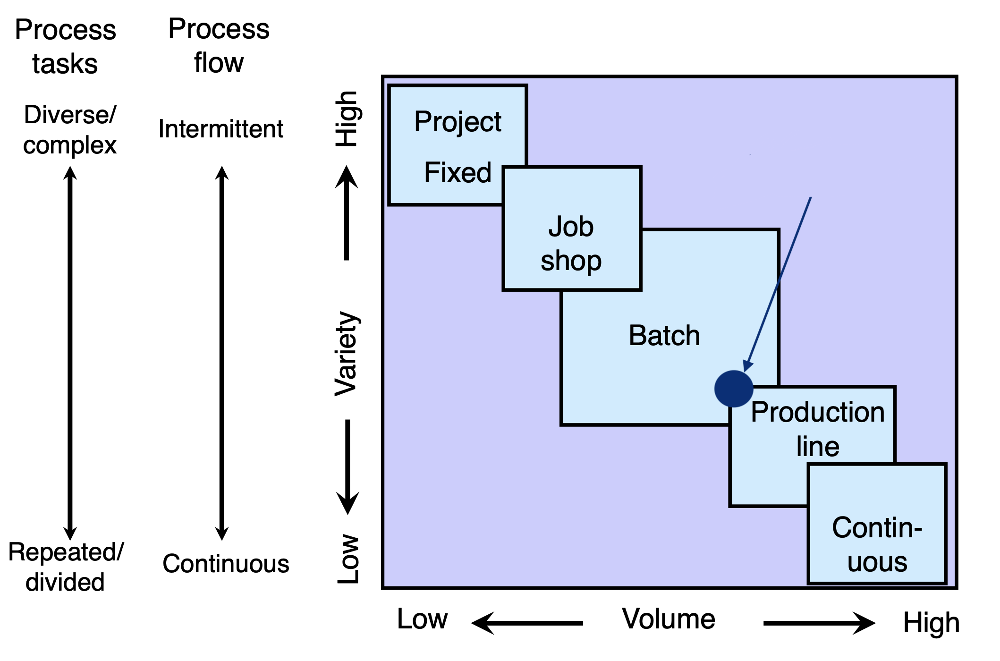
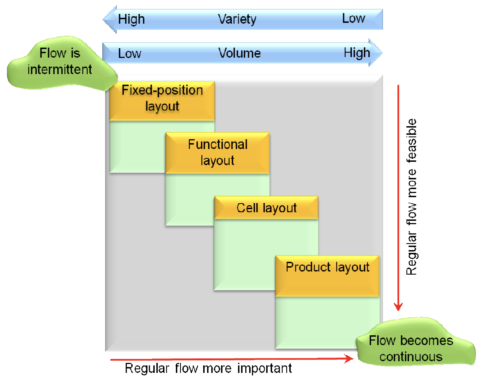

# Operations

## Introduction

### Our products

IR2 is a company that produces 2 kind of robots for a domestic usage:

- Dolly: the robot vacuum cleaner
- Molly: the mop robot

These robots are very similar each other in terms of architecture, design and mechanical/electronic components.

Currently on the market there are the line S, released some years ago and near to the end of it life cycle, and the line X, the the spearhead of the company.
Dolly and Molly of the line X are more powerful, more accurate and smarter.

Of course, the production focus is on the last line released, but we are still producing an huge amount of product of the line S.

## The activity

Our company has a factory based in Tuscany, in which about a hundred of people are employed. This factory deals only with the assembly phase, because the company has agreements with several firms for the supplies.
There both the two lines of robots are assembled.
Our production is characterized by medium volume and medium variability: because we have substantially 4 distinct products althought they are similar.

## Product Flow & Layout

Considering the previous statements, our company is in this situation:

So we have adopted an hybrid between batch environment and line process: the group technology.
The principle is that many problems are similar and by grouping similar problems, a single solution can be found to a set of problems, thus saving time and effort.
We can adopt this solution because there are some parts in the assembly phase that are very similar each other and use similar machinery, but we mantain a throughput higher than the batch process.

According to this, the manufactoring of our company is organized in a Cellular Layout.
The machines are grouped according to the process requirements for a set of similar items that require similar processing.
Workers in cellular layouts are cross-trained so that they can operate all the equipment within the cell and take responsibility for its output.
It's very often used in assembly phase.

[//]: <> (King's Algorithm)