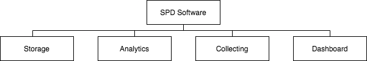

# Project Title: Big Data Collecting and Analytics Platform for Strategic Product Development

## A. Request for proposal
In this request for proposal there are the requirements for an open and competitive process for a software forniture.

Proposal will be accepted until 4:30 pm May 30, 2020. Any proposal received after the end date will be rejected. Contract terms and condition will be negotiated with the winning bidder for this RFP. Contractual terms and condition will be reviewd by the IR2 legal department and will include scope, budget, schedule and all the necessary items pertaining to the project.

## B. Introduction/Background
IR2 operates in Italy and Europe and builds household robots for cleaning. Our products have high-quality components, innovative software and design, and relies an advanced research and development department that collaborates with the world most important robotic institutes such as Istituto Italiano di tecnologia, Centro di ricerca E.Piaggio and Politecnico di Milano. Currently, for our processes we use a custom web-application. Moreover, we have a website, on which customers can buy our products and write aftersales reviews, and a mobile application through which customers can manage their robots and report problems. Therefore, it was decided to improve the managing of the output data coming from our r&d departement and integrate those data with customers feedbacks. 

## C. Objectives
The objective of this project is to improve our products development by creating a platform able to manage big data and integrate from different sources.

## D. Scope of Work
The scope of this project is to design, implement and licensing the strategic product development software for IR2. Project works includes:
- A development of a storage platform able to manage big data.
- A development of a data collecting and merging tool that retrieve and merge r&d department data and customer reviews from our website, our mobile application and our social network profiles.
- A development of an analytics system for the stored data that includes predictive models.
- A development of a dashboard in our web-aaplication from which our employees can access and visualize data and reports.

The software should respect the following requirements:
- The dashboard should be user-friendly and is easy to navigate.
- The system should be integrated in our existing web-application.
- The system should reduce at minimum the risk of data losses.
- The data should be visualized for type of product and date.
- The system should forecast an approval rating per product
- The system should show tag clouds and histograms of review's trending topic. 
- The system should have the R&D datasheet search by keywords.
- The system should have the reviews search by keywords. 
- The system should show reports on past selling trends along with forecasted selling trends.
- The system should show R&D reports related with topic based on customer reviews.
- The system should identify the most active customers.
- The system should be compliant with the GDPR.

## E. Milestones
- Overall system design proposal in form of document (1 Week after project start date).
- Overall system architecture proposal in form of document (2 Weeks after project start date).
- Dashboard design proposal in form of mokups (3 Weeks after project start date).
- First software demo and report of implemented features and performed tests (4 Weeks after project start date).
- Second software demo and report of implemented features and performed tests (8 Weeks after project start date).
- Third software demo and report of implemented features and performed tests (12 Weeks after project start date).
- Fourth software demo and report of implemented features and performed tests (16 Weeks after porject start date).
- Final dashboard design proposal (17 Weeks after project start date).
- Final system prototype and user manual (20 Weeks after project start date).
- Final report of tests performed on the system before deployment (24 Weeks Months after starting).

## F. WBS

## G. Budget
All proposal must inlude cost to complete the tasks described in the project scope. Pricing should be listed for each of the following items:
- IaaS costs if any.
- Project initiation and planning.
- Software development.
- Software testing.
- Software deployment.

## H. Request documents
All bid should include a preliminary design of the solution, a detailed description of how it will be developed including technologies and a detailed description of costs with fees. Both IaaS and on-premise solution would be evaluated.

## I. Evalutation criteria
IR2 will evaluate bidders proposals on the following criteria:
- Overal proposal suitability: the poposed solution should meet the the scope of this project.
- Value and cost: bidders will be evaluated on the cost of the proposed solution based on the work to be performed.